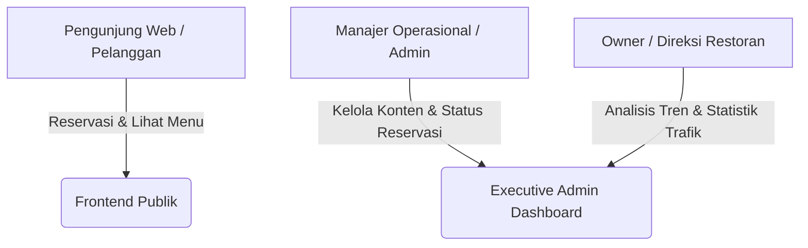
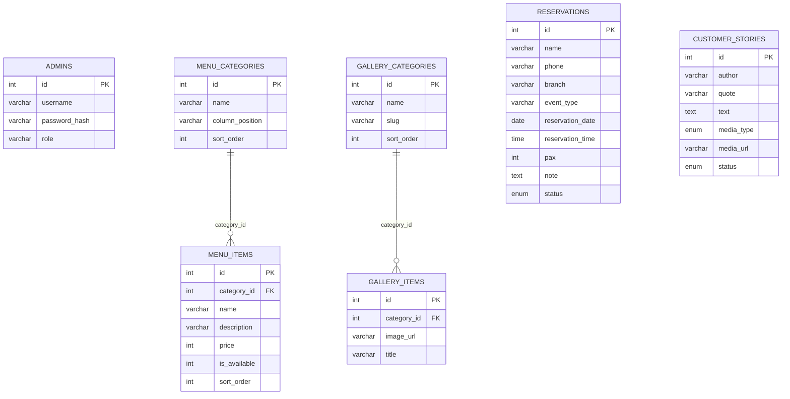
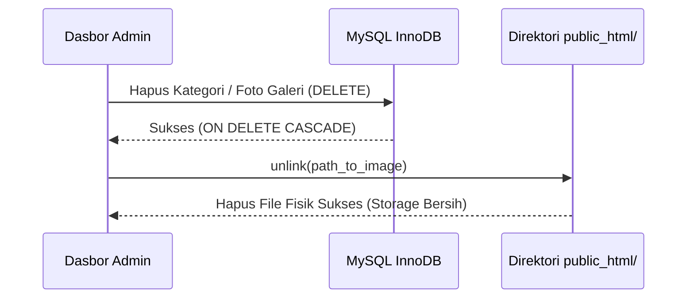

# PRODUCT REQUIREMENTS DOCUMENT (PRD)
## UNIVERSAL PREMIUM RESTAURANT WEB ECOSYSTEM & EXECUTIVE ANALYTICS DASHBOARD
**Dokumen Kebutuhan Produk (PRD) - Template Acuan Rekayasa Perangkat Lunak HANSCO**

---

## DOKUMEN KONTROL
*   **Kode Produk:** PRD-SWE/RESTO-ECO/V1
*   **Versi:** 1.0.0 (Production-Ready)
*   **Tanggal Rilis:** 26 Mei 2026
*   **Penulis:** Kevin (Founder HANSCO)
*   **Status:** FINAL & APPROVED
*   **Hak Cipta:** HANSCO © 2026. Hak Penggunaan Tanpa Batas diberikan kepada Mitra Restoran.

---

## 1. RINGKASAN EKSEKUTIF & VISI PRODUK

### 1.1 Latar Belakang
Restoran berskala premium dan menengah ke atas sering kali menghadapi tantangan ketergantungan yang tinggi terhadap platform agregator pihak ketiga (seperti ojek online atau aplikasi pemesanan luar) yang memotong margin keuntungan besar serta membatasi kekuatan *branding* independen. 

### 1.2 Visi Produk
Membangun sebuah **Ekosistem Digital Independen Terintegrasi** yang menggabungkan:
1.  **Frontend Publik Premium:** Antarmuka visual kelas tinggi berbasis *Dark-Gold Glassmorphism* yang merepresentasikan kemewahan kultural masakan autentik, dioptimalkan untuk memicu konversi reservasi dan kunjungan langsung.
2.  **Executive Admin Dashboard privat:** Panel operasional dinamis berbasis database relasional terpadu yang memberikan kebebasan mutlak bagi manajemen untuk mengelola konten dan meninjau wawasan bisnis (*analytics*) secara waktu-nyata (*real-time*).

### 1.3 Tujuan Utama (Product Goals)
*   **Kemandirian Digital:** Memotong komisi pihak ketiga dengan mengalihkan pemesanan/reservasi langsung ke WhatsApp terenkripsi per cabang.
*   **Operasional Fleksibel:** Pengelolaan menu makanan, galeri foto relasional, dan ulasan pelanggan dapat diubah 100% dari dasbor tanpa menyentuh satu baris kode pemrograman pun.
*   **Keamanan Eksekutif:** Dasbor privat dengan proteksi tingkat tinggi dari serangan *brute force*, penyaringan unggahan media jahat, dan penataan kapasitas hosting.

---

## 2. PENGGUNA SASARAN (USER PERSONAS)

### 2.1 Pengunjung Umum / Pelanggan (*End-User*)
*   **Kebutuhan:** Melihat menu masakan secara cepat, mengecek ketersediaan hidangan, melihat suasana restoran lewat galeri resolusi tinggi, mengajukan reservasi instan tanpa ribet, serta membaca FAQ cabang terdekat.
*   **Karakteristik:** Menggunakan perangkat seluler (smartphone), menyukai antarmuka visual yang elegan, dan menuntut kecepatan *page load* di bawah 2 detik.

### 2.2 Manajer Operasional / Admin Restoran
*   **Kebutuhan:** Memantau reservasi masuk, memperbarui ketersediaan menu makanan yang habis hari ini secara instan, mengubah kategori foto galeri, serta mengoreksi atau menyetujui ulasan cerita pelanggan (*Customer Stories*).
*   **Karakteristik:** Mengakses sistem lewat komputer/tablet di lokasi restoran, membutuhkan antarmuka administrasi yang sederhana namun cepat dan aman.

### 2.3 Pemilik Restoran / Eksekutif (*Owner*)
*   **Kebutuhan:** Memantau performa lalu lintas pengunjung, wawasan analitik perangkat pengakses, popularitas reservasi per cabang, serta pengawasan administrasi keuangan secara menyeluruh.

---

## 3. ARSITEKTUR TEKNOLOGI & DATA MODEL

Sistem ini dirancang menggunakan teknologi **Vanilla Modular Stack** berkinerja tinggi:
*   **Frontend:** HTML5, CSS3 (Custom Vanilla Grid & Flexbox), Vanilla JavaScript (filter masonry galeri).
*   **Backend:** PHP (Modular OOP/Procedural secure PDO).
*   **Database:** MySQL (InnoDB Relational engine dengan integritas *ON DELETE CASCADE*).
*   **Integrasi:** WhatsApp Click-to-Chat API, cPanel Physical Storage Cleaner (`unlink`).

### 3.1 Skema Database Relasional (Entity Relationship Diagram)

---

## 4. PERSYARATAN FUNGSIONAL (FUNCTIONAL REQUIREMENTS)

### 4.1 Modul Frontend Publik (FR-FE)

| ID Persyaratan | Fitur Utama | Deskripsi Spesifikasi Kebutuhan |
| :--- | :--- | :--- |
| **FR-FE-001** | Beranda Premium (Home) | Layout responsif Dark-Gold, efek transparansi Glassmorphism, masonry grid, pilar nilai keunggulan restoran, dan tombol Call-To-Action (CTA) reservasi melayang. |
| **FR-FE-002** | Menu Dinamis | Menampilkan daftar hidangan langsung dari database secara real-time. Menu dikelompokkan otomatis berdasarkan `menu_categories` dan diurutkan sesuai `sort_order`. |
| **FR-FE-003** | Penanda Sold-Out | Hidangan yang ditandai tidak tersedia (`is_available = 0`) di dasbor admin wajib dirender otomatis dengan label visual "Habis" dan tombol pemesanan dinonaktifkan. |
| **FR-FE-004** | Galeri Relasional | Menampilkan masonry gallery dengan tombol filter kategori dinamis berbasis slug JavaScript. Foto diambil langsung secara relasional dari tabel database. |
| **FR-FE-005** | Form Jurnal Stories | Pengunjung dapat mengunggah cerita puitis/pengalaman beserta media foto/video. Data masuk ke database dengan status bawaan `Pending`. |
| **FR-FE-006** | Reservasi WhatsApp | Pengunjung mengisi detail reservasi (Nama, WA, Cabang, Jumlah Pax, Tanggal, Jam). Saat disubmit, data terekam di DB lokal dan sistem meluncurkan pemesanan ke WA nomor cabang terpilih menggunakan URI encoded teks. |

---

### 4.2 Modul Executive Admin Dashboard (FR-AD)

| ID Persyaratan | Fitur Utama | Deskripsi Spesifikasi Kebutuhan |
| :--- | :--- | :--- |
| **FR-AD-001** | BCRYPT Secure Login | Akses dasbor dilindungi enkripsi standar industri `BCRYPT` pada tabel admins. Sesi admin diamankan dengan fungsi sanitasi session PHP. |
| **FR-AD-002** | CRUD Menu Ganda | Admin dapat mengelola Kategori Menu (termasuk penentuan kolom cetak layout menu Kiri/Kanan) serta Item Hidangan (Nama, Deskripsi, Harga, dan Switch Ketersediaan). |
| **FR-AD-003** | CRUD Galeri Ganda | Admin dapat mengelola Kategori Galeri serta mengunggah Foto Galeri baru. Dropdown pemilihan kategori wajib ditarik secara dinamis dari database. |
| **FR-AD-004** | Upload File Aman | Uploader dasbor membatasi format file (hanya gambar `.webp`, `.png`, `.jpg`, `.jpeg` maks 10MB; dan video `.mp4`, `.webm` maks 50MB) serta menyamarkan nama file secara acak menggunakan *timestamp* dan *random hex* demi keamanan server. |
| **FR-AD-005** | Garbage Collection | Setiap kali data item foto galeri atau kategori dihapus dari dasbor, skrip PHP di backend wajib memicu fungsi `unlink()` untuk **menghapus berkas fisik gambar di penyimpanan hosting**. Ini mencegah penumpukan file sampah tak berguna. |
| **FR-AD-006** | CRUD Stories & Approval | Admin dapat menguji ulasan yang dikirim publik. Pilihan aksi: **Approve** (ulasan terbit otomatis di web), **Sunting** (mengedit nama/isi), atau **Delete** (menghapus permanen). |
| **FR-AD-007** | CRUD Reservasi & WA | Admin dapat meninjau seluruh data tamu masuk, mengubah status reservasi (*Pending, Confirmed, Cancelled*), dan menekan tombol chat langsung menuju nomor WhatsApp tamu tersebut menggunakan tautan API. |

---

## 5. PERSYARATAN NON-FUNGSIONAL (NON-FUNCTIONAL REQUIREMENTS)

### 5.1 Kinerja & Performa (Performance)
*   **Waktu Muat (Page Load Time):** Halaman publik wajib dimuat di bawah **2,0 detik** pada koneksi 4G standar.
*   **Optimalisasi Gambar:** Seluruh aset visual publik wajib dikompresi ke dalam ekstensi **`.webp`** modern untuk menghemat bandwidth server dan mempercepat pemuatan halaman.
*   **Clean Garbage Collection:** Kapasitas disk cPanel harus selalu terjaga dengan memastikan tidak ada file gambar tanpa referensi database tertinggal di folder `/uploads`.

### 5.2 Optimasi Mesin Pencari (Technical SEO)
*   **Google Structured Data (JSON-LD):** Halaman menu dan beranda harus ditanami skema data terstruktur dari Schema.org (`@type: Restaurant` dan `@type: FoodEstablishment`) secara dinamis sesuai database untuk memunculkan informasi menu di pencarian Google.
*   **Meta Tag Dinamis:** Setiap halaman wajib memiliki keunikan title tag, deskripsi meta, heading structure (`<h1>` tunggal), serta atribut penulisan alt-tag pada gambar.

### 5.3 Antarmuka & UX Responsif (Premium UX)
*   **Desktop Dashboard:** Sidebar navigasi vertikal dilengkapi kemampuan gulir internal jika layar beresolusi vertikal rendah (laptop 14 inci) untuk mencegah pemotongan tombol keluar (*logout*).
*   **Mobile Dashboard Swipe Navigation:** Saat dasbor dibuka di layar smartphone (di bawah 991px), menu navigasi bawah otomatis ditransformasikan menjadi **Bar Geser Horizontal (Horizontal Swipe Bar)** satu baris yang sangat rapi layaknya aplikasi seluler modern.

---

## 6. RENCANA PENGEMBANGAN LANJUTAN (ROADMAP FUTURE)

1.  **Termin 1 (Ekosistem Inti - Selesai):** Pembuatan Landing Page dinamis, Sistem Database Relasional Menu/Galeri, dan Dasbor Admin CRUD Terintegrasi.
2.  **Termin 2 (Optimasi & Rilis - Selesai):** Penyempurnaan UX Responsif, Pembuat Laporan PDF Bisnis, Rekonsiliasi Finansial Infrastruktur, dan Pembersihan Migrasi Server Produksi.
3.  **Termin 3 (Skalabilitas Lanjutan - Rencana):**
    *   *Multi-Branch POS Integration:* Menghubungkan database web langsung dengan mesin kasir di outlet restoran.
    *   *Real-time Table Booking:* Peta meja restoran interaktif untuk memilih kursi secara langsung.
    *   *QRIS Payment Gateway:* Integrasi Midtrans atau Xendit untuk pembayaran uang muka (DP) reservasi online secara instan dan aman.

---

📝 **LEMBAR PENGESAHAN DOKUMEN PRD:**

**Jakarta, 26 Mei 2026**

| Dibuat oleh, | Disetujui oleh, |
| :---: | :---: |
| **HANSCO** | **Mitra Restoran** |
| | |
| *(Tanda Tangan Elektronik)* | *(Tanda Tangan Elektronik)* |
| | |
| **Kevin** *Founder HANSCO* | **Manajemen / Owner Resto** |
